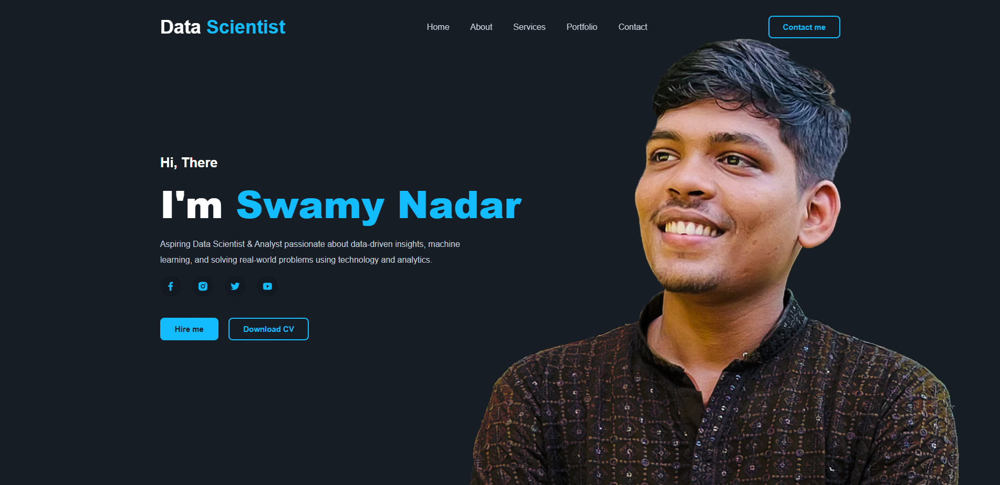

# 🌐 Personal Portfolio Website

Welcome to my personal portfolio website! This site showcases my projects, skills, certifications, and experiences as an aspiring Data Scientist & Analyst.

## 🔗 Live Website

Visit the live site here: [https://muthuswamynadar.github.io/](https://muthuswamynadar.github.io/)


## 👨‍💻 About Me

I'm **Muthuswamy Nadar**, an aspiring **Data Scientist & Analyst** with a passion for solving real-world problems using data. I specialize in:

- Python, SQL, Power BI
- Data Visualization & Dashboarding
- Machine Learning & Statistical Analysis
- Data Cleaning & Preprocessing

## 📁 Features

- 🧑‍💼 About Section  
- 💼 Projects Showcase  
- 📜 Resume Download  
- 📬 Contact Form  
- 📱 Responsive Design  
- 🌙 Light/Dark Theme Toggle (if applicable)

## 🛠️ Tech Stack

- HTML5
- CSS3 (with animations & responsiveness)
- JavaScript
- GitHub Pages for Deployment

## 📸 Preview



>

## 🚀 Getting Started

1. Fork or clone the repository
2. Make changes locally
3. Push to your GitHub repository
4. Enable GitHub Pages from the settings

```bash
git clone https://github.com/muthuswamynadar/muthuswamynadar.github.io


---

### 📄 LICENSE (MIT)

Create a file named `LICENSE` in the root directory of your repository and add the following:

```text
MIT License

Copyright (c) 2025 Muthuswamy Nadar

Permission is hereby granted, free of charge, to any person obtaining a copy
of this software and associated documentation files (the "Software"), to deal
in the Software without restriction, including without limitation the rights
to use, copy, modify, merge, publish, distribute, sublicense, and/or sell
copies of the Software, and to permit persons to whom the Software is
furnished to do so, subject to the following conditions:

The above copyright notice and this permission notice shall be included in all
copies or substantial portions of the Software.

THE SOFTWARE IS PROVIDED "AS IS", WITHOUT WARRANTY OF ANY KIND, EXPRESS OR
IMPLIED, INCLUDING BUT NOT LIMITED TO THE WARRANTIES OF MERCHANTABILITY,
FITNESS FOR A PARTICULAR PURPOSE AND NONINFRINGEMENT. IN NO EVENT SHALL THE
AUTHORS OR COPYRIGHT HOLDERS BE LIABLE FOR ANY CLAIM, DAMAGES OR OTHER
LIABILITY, WHETHER IN AN ACTION OF CONTRACT, TORT OR OTHERWISE, ARISING FROM,
OUT OF OR IN CONNECTION WITH THE SOFTWARE OR THE USE OR OTHER DEALINGS IN THE
SOFTWARE.
